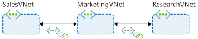
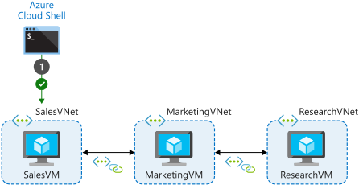
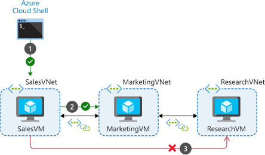
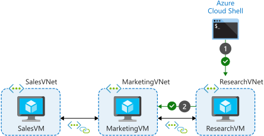
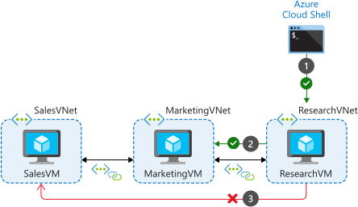
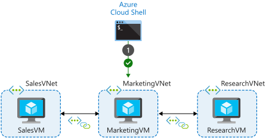
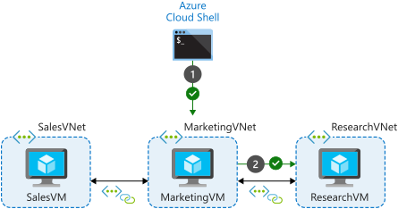
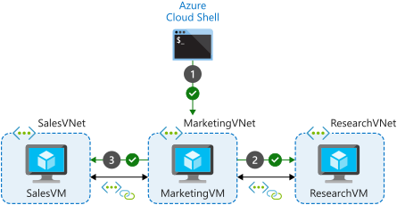

# Virtual Network Peering 

When connecting via peering, the VMx in these virtual networks can communicate with each other as if they are in the same network.  This should be the first choice unless you have existing VPN or ExpressRoute connections or services behind Azure Basic Load Balancers.


*Let's create three virtual networks on Azure cloud and configure them to connect via global virtual network peering method.*

1. The `Sales` VNet is deployed in `North Europe` region.  The Sales team wants access to Marketing data.

2. The `Marketing` VNet is deployed in `North Europe` region.  Members of the Marketing team regularly chat with the Sales team.  Data is shared via download because `Sales` and `Marketing` do not have connection   

3. The `Research` VNet is deployed in the `West Europe` region.  Members of the Research team have a logical working relationship with Marketing but they do not want the Sales team to have direct access to their data.


## Create Sales VNet using Azure-CLI

In Cloud Shell, run the following command to create the virtual network and subnet for the Sales systems:

```
az network vnet create --resource-group learn-4b116c1a-4db8-4f09-b42a-9528a56f3339 --name SalesVNet --address-prefixes 10.1.0.0/16 --subnet-name Apps --subnet-prefixes 10.1.1.0/24 --location northeurope
```

*Output:*

```
{
  "newVNet": {
    "addressSpace": {
      "addressPrefixes": [
        "10.1.0.0/16"
      ]
    },
    "enableDdosProtection": false,
    "etag": "W/\"1b7d6ba9-4a1b-4236-afee-fb2a05d74a87\"",
    "id": "/subscriptions/bbd2d6bc-2bb3-440e-843d-917ae7f983fe/resourceGroups/learn-4b116c1a-4db8-4f09-b42a-9528a56f3339/providers/Microsoft.Network/virtualNetworks/SalesVNet",
    "location": "northeurope",
    "name": "SalesVNet",
    "provisioningState": "Succeeded",
    "resourceGroup": "learn-4b116c1a-4db8-4f09-b42a-9528a56f3339",
    "resourceGuid": "f2052ec9-56cb-4ab5-b980-31edba278edf",
    "subnets": [
      {
        "addressPrefix": "10.1.1.0/24",
        "delegations": [],
        "etag": "W/\"1b7d6ba9-4a1b-4236-afee-fb2a05d74a87\"",
        "id": "/subscriptions/bbd2d6bc-2bb3-440e-843d-917ae7f983fe/resourceGroups/learn-4b116c1a-4db8-4f09-b42a-9528a56f3339/providers/Microsoft.Network/virtualNetworks/SalesVNet/subnets/Apps",
        "name": "Apps",
        "networkSecurityGroup": {
          "id": "/subscriptions/bbd2d6bc-2bb3-440e-843d-917ae7f983fe/resourceGroups/SandboxNSGs/providers/Microsoft.Network/networkSecurityGroups/NSG-northeurope",
          "resourceGroup": "SandboxNSGs"
        },
        "privateEndpointNetworkPolicies": "Disabled",
        "privateLinkServiceNetworkPolicies": "Enabled",
        "provisioningState": "Succeeded",
        "resourceGroup": "learn-4b116c1a-4db8-4f09-b42a-9528a56f3339",
        "type": "Microsoft.Network/virtualNetworks/subnets"
      }
    ],
    "type": "Microsoft.Network/virtualNetworks",
    "virtualNetworkPeerings": []
  }
}
```

## Create Marketing VNet using Azure-CLI

Run the following command to create the virtual network and subnet for the Marketing systems:

```
az network vnet create --resource-group learn-4b116c1a-4db8-4f09-b42a-9528a56f3339 --name MarketingVNet --address-prefixes 10.2.0.0/16 --subnet-name Apps --subnet-prefixes 10.2.1.0/24 --location northeurope
```

*Output:*

```
{
  "newVNet": {
    "addressSpace": {
      "addressPrefixes": [
        "10.2.0.0/16"
      ]
    },
    "enableDdosProtection": false,
    "etag": "W/\"b9a1d42b-5cdc-4a12-b5db-f29bc82a7f27\"",
    "id": "/subscriptions/bbd2d6bc-2bb3-440e-843d-917ae7f983fe/resourceGroups/learn-4b116c1a-4db8-4f09-b42a-9528a56f3339/providers/Microsoft.Network/virtualNetworks/MarketingVNet",
    "location": "northeurope",
    "name": "MarketingVNet",
    "provisioningState": "Succeeded",
    "resourceGroup": "learn-4b116c1a-4db8-4f09-b42a-9528a56f3339",
    "resourceGuid": "b4743ff9-61ad-4ed1-8970-a8309e5b2e46",
    "subnets": [
      {
        "addressPrefix": "10.2.1.0/24",
        "delegations": [],
        "etag": "W/\"b9a1d42b-5cdc-4a12-b5db-f29bc82a7f27\"",
        "id": "/subscriptions/bbd2d6bc-2bb3-440e-843d-917ae7f983fe/resourceGroups/learn-4b116c1a-4db8-4f09-b42a-9528a56f3339/providers/Microsoft.Network/virtualNetworks/MarketingVNet/subnets/Apps",
        "name": "Apps",
        "networkSecurityGroup": {
          "id": "/subscriptions/bbd2d6bc-2bb3-440e-843d-917ae7f983fe/resourceGroups/SandboxNSGs/providers/Microsoft.Network/networkSecurityGroups/NSG-northeurope",
          "resourceGroup": "SandboxNSGs"
        },
        "privateEndpointNetworkPolicies": "Disabled",
        "privateLinkServiceNetworkPolicies": "Enabled",
        "provisioningState": "Succeeded",
        "resourceGroup": "learn-4b116c1a-4db8-4f09-b42a-9528a56f3339",
        "type": "Microsoft.Network/virtualNetworks/subnets"
      }
    ],
    "type": "Microsoft.Network/virtualNetworks",
    "virtualNetworkPeerings": []
  }
}
```


## Create Research VNet using Azure-CLI

Run the following command to create the virtual network and subnet for the Research systems:

```
az network vnet create --resource-group learn-4b116c1a-4db8-4f09-b42a-9528a56f3339 --name ResearchVNet --address-prefixes 10.3.0.0/16 --subnet-name Data --subnet-prefixes 10.3.1.0/24 --location westeurope
```


*Output:*

```
{
  "newVNet": {
    "addressSpace": {
      "addressPrefixes": [
        "10.3.0.0/16"
      ]
    },
    "enableDdosProtection": false,
    "etag": "W/\"e5152332-0fec-4f60-9408-c766bdc3c08b\"",
    "id": "/subscriptions/bbd2d6bc-2bb3-440e-843d-917ae7f983fe/resourceGroups/learn-4b116c1a-4db8-4f09-b42a-9528a56f3339/providers/Microsoft.Network/virtualNetworks/ResearchVNet",
    "location": "westeurope",
    "name": "ResearchVNet",
    "provisioningState": "Succeeded",
    "resourceGroup": "learn-4b116c1a-4db8-4f09-b42a-9528a56f3339",
    "resourceGuid": "0e5121d8-8543-44d5-ba82-8b7de07f866c",
    "subnets": [
      {
        "addressPrefix": "10.3.1.0/24",
        "delegations": [],
        "etag": "W/\"e5152332-0fec-4f60-9408-c766bdc3c08b\"",
        "id": "/subscriptions/bbd2d6bc-2bb3-440e-843d-917ae7f983fe/resourceGroups/learn-4b116c1a-4db8-4f09-b42a-9528a56f3339/providers/Microsoft.Network/virtualNetworks/ResearchVNet/subnets/Data",
        "name": "Data",
        "networkSecurityGroup": {
          "id": "/subscriptions/bbd2d6bc-2bb3-440e-843d-917ae7f983fe/resourceGroups/SandboxNSGs/providers/Microsoft.Network/networkSecurityGroups/NSG-westeurope",
          "resourceGroup": "SandboxNSGs"
        },
        "privateEndpointNetworkPolicies": "Disabled",
        "privateLinkServiceNetworkPolicies": "Enabled",
        "provisioningState": "Succeeded",
        "resourceGroup": "learn-4b116c1a-4db8-4f09-b42a-9528a56f3339",
        "type": "Microsoft.Network/virtualNetworks/subnets"
      }
    ],
    "type": "Microsoft.Network/virtualNetworks",
    "virtualNetworkPeerings": []
  }
}
```


# Confirm the VNets configuration

To view:

```
az network vnet list --query "[?contains(provisioningState, 'Succeeded')]" --output table
```


*Output:*

```
Location     Name           EnableDdosProtection    ProvisioningState    ResourceGuid                          ResourceGroup
-----------  -------------  ----------------------  -------------------  ------------------------------------  ------------------------------------------
northeurope  MarketingVNet  False                   Succeeded            b4743ff9-61ad-4ed1-8970-a8309e5b2e46  learn-4b116c1a-4db8-4f09-b42a-9528a56f3339
northeurope  SalesVNet      False                   Succeeded            f2052ec9-56cb-4ab5-b980-31edba278edf  learn-4b116c1a-4db8-4f09-b42a-9528a56f3339
westeurope   ResearchVNet   False                   Succeeded            0e5121d8-8543-44d5-ba82-8b7de07f866c  learn-4b116c1a-4db8-4f09-b42a-9528a56f3339
```


# Create virtual machines in each virtual network

Now, you'll deploy some Ubuntu virtual machines (VMs) in each of the virtual networks. These VMs simulate the services in each virtual network. In the final unit of this module, you'll use these VMs to test connectivity between the virtual networks.


- In Cloud Shell, run the following command, replacing <password> with a password that meets the requirements for Linux VMs, to create an Ubuntu VM in the Apps subnet of SalesVNet. Note this password for later use.

```
az vm create --resource-group learn-4b116c1a-4db8-4f09-b42a-9528a56f3339 --no-wait --name SalesVM --location northeurope --vnet-name SalesVNet --subnet Apps --image Ubuntu2204 --admin-username azureuser --admin-password <password>
```

e.g.

```
markn [ ~ ]$ az vm create --resource-group learn-4b116c1a-4db8-4f09-b42a-9528a56f3339 --no-wait --name SalesVM --location northeurope --vnet-name SalesVNet --subnet Apps --image Ubuntu2204 --admin-username azureuser --admin-password markN123@Azura
```

- Run the following command, replacing <password> with a password that meets the requirements for Linux VMs, to create another Ubuntu VM in the Apps subnet of MarketingVNet. Note this password for later use. The VM may take a minute or two to be created.

```
az vm create --resource-group learn-4b116c1a-4db8-4f09-b42a-9528a56f3339 --no-wait --name MarketingVM --location northeurope --vnet-name MarketingVNet --subnet Apps --image Ubuntu2204 --admin-username azureuser --admin-password <password>
```

e.g.

```
markn [ ~ ]$ az vm create --resource-group learn-4b116c1a-4db8-4f09-b42a-9528a56f3339 --no-wait --name MarketingVM --location northeurope --vnet-name MarketingVNet --subnet Apps --image Ubuntu2204 --admin-username azureuser --admin-password markN123@Azura
```


- Run the following command, replacing <password> with a password that meets the requirements for Linux VMs, to create an Ubuntu VM in the Data subnet of ResearchVNet. Note this password for later use.

```
az vm create --resource-group learn-4b116c1a-4db8-4f09-b42a-9528a56f3339 --no-wait --name ResearchVM --location westeurope --vnet-name ResearchVNet --subnet Data --image Ubuntu2204 --admin-username azureuser --admin-password <password>
```


*Output:*

```
Selecting "uksouth" may reduce your costs. The region you've selected may cost more for the same services. You can disable this message in the future with the command "az config set core.display_region_identified=false". Learn more at https://go.microsoft.com/fwlink/?linkid=222571
```


- To confirm that the VMs are running, run the following command. The Linux watch command is configured to refresh every five seconds.

```
watch -d -n 5 "az vm list \
    --resource-group learn-4b116c1a-4db8-4f09-b42a-9528a56f3339 \
    --show-details \
    --query '[*].{Name:name, ProvisioningState:provisioningState, PowerState:powerState}' \
    --output table"
```

*Output:*

```
Every 5.0s...  SandboxHost-638366955739826176: Mon Nov 27 16:47:43 2023

Name         ProvisioningState    PowerState
-----------  -------------------  ------------
MarketingVM  Succeeded            VM running
SalesVM      Succeeded            VM running
ResearchVM   Succeeded            VM running
```

---
*Note: A ProvisioningState of Succeeded and a PowerState of VM running indicates a successful deployment for the VM.


<br />
<lr />

# Configure virtual network peering connections by using Azure CLI commands

To enable communication, you need to create peering connections for the virtual networks. To satisfy your company's requirements, you'll configure a hub and spoke topology and permit virtual network access when you create the peering connections.

## Create virtual network peering connections

- Follow these steps to create connections between the virtual networks and to configure the behavior of each connection.

In Cloud Shell, run the following command to create the peering connection between the SalesVNet and MarketingVNet virtual networks. This command also permits virtual network access across this peering connection.

```
az network vnet peering create --name SalesVNet-To-MarketingVNet --remote-vnet MarketingVNet --resource-group learn-4b116c1a-4db8-4f09-b42a-9528a56f3339 --vnet-name SalesVNet --allow-vnet-access
```

*Output:*

```
{
  "allowForwardedTraffic": false,
  "allowGatewayTransit": false,
  "allowVirtualNetworkAccess": true,
  "doNotVerifyRemoteGateways": false,
  "etag": "W/\"6deb1192-2787-4bbf-b0ae-a40d8a137b55\"",
  "id": "/subscriptions/bbd2d6bc-2bb3-440e-843d-917ae7f983fe/resourceGroups/learn-4b116c1a-4db8-4f09-b42a-9528a56f3339/providers/Microsoft.Network/virtualNetworks/SalesVNet/virtualNetworkPeerings/SalesVNet-To-MarketingVNet",
  "name": "SalesVNet-To-MarketingVNet",
  "peeringState": "Initiated",
  "peeringSyncLevel": "RemoteNotInSync",
  "provisioningState": "Succeeded",
  "remoteAddressSpace": {
    "addressPrefixes": [
      "10.2.0.0/16"
    ]
  },
  "remoteVirtualNetwork": {
    "id": "/subscriptions/bbd2d6bc-2bb3-440e-843d-917ae7f983fe/resourceGroups/learn-4b116c1a-4db8-4f09-b42a-9528a56f3339/providers/Microsoft.Network/virtualNetworks/MarketingVNet",
    "resourceGroup": "learn-4b116c1a-4db8-4f09-b42a-9528a56f3339"
  },
  "remoteVirtualNetworkAddressSpace": {
    "addressPrefixes": [
      "10.2.0.0/16"
    ]
  },
  "resourceGroup": "learn-4b116c1a-4db8-4f09-b42a-9528a56f3339",
  "resourceGuid": "46711130-3766-0464-30f0-99dd247ca099",
  "type": "Microsoft.Network/virtualNetworks/virtualNetworkPeerings",
  "useRemoteGateways": false
}
```


- Run the following command to create a reciprocal connection from MarketingVNet to SalesVNet. This step completes the connection between these virtual networks.

```
az network vnet peering create --name MarketingVNet-To-SalesVNet --remote-vnet SalesVNet --resource-group learn-4b116c1a-4db8-4f09-b42a-9528a56f3339 --vnet-name MarketingVNet --allow-vnet-access
```

*Output:*

```
{
  "allowForwardedTraffic": false,
  "allowGatewayTransit": false,
  "allowVirtualNetworkAccess": true,
  "doNotVerifyRemoteGateways": false,
  "etag": "W/\"f8d5442d-b7ea-4f98-94e6-fa7b15b6dcc1\"",
  "id": "/subscriptions/bbd2d6bc-2bb3-440e-843d-917ae7f983fe/resourceGroups/learn-4b116c1a-4db8-4f09-b42a-9528a56f3339/providers/Microsoft.Network/virtualNetworks/MarketingVNet/virtualNetworkPeerings/MarketingVNet-To-SalesVNet",
  "name": "MarketingVNet-To-SalesVNet",
  "peeringState": "Connected",
  "peeringSyncLevel": "FullyInSync",
  "provisioningState": "Succeeded",
  "remoteAddressSpace": {
    "addressPrefixes": [
      "10.1.0.0/16"
    ]
  },
  "remoteVirtualNetwork": {
    "id": "/subscriptions/bbd2d6bc-2bb3-440e-843d-917ae7f983fe/resourceGroups/learn-4b116c1a-4db8-4f09-b42a-9528a56f3339/providers/Microsoft.Network/virtualNetworks/SalesVNet",
    "resourceGroup": "learn-4b116c1a-4db8-4f09-b42a-9528a56f3339"
  },
  "remoteVirtualNetworkAddressSpace": {
    "addressPrefixes": [
      "10.1.0.0/16"
    ]
  },
  "resourceGroup": "learn-4b116c1a-4db8-4f09-b42a-9528a56f3339",
  "resourceGuid": "46711130-3766-0464-30f0-99dd247ca099",
  "type": "Microsoft.Network/virtualNetworks/virtualNetworkPeerings",
  "useRemoteGateways": false
}
```


Now that you have connections between Sales and Marketing, create connections between Marketing and Research.

In Cloud Shell, run the following command to create the peering connection between the MarketingVNet and ResearchVNet virtual networks:


```
az network vnet peering create --name MarketingVNet-To-ResearchVNet --remote-vnet ResearchVNet --resource-group learn-4b116c1a-4db8-4f09-b42a-9528a56f3339 --vnet-name MarketingVNet --allow-vnet-access
```


*Output:*

```
{
  "allowForwardedTraffic": false,
  "allowGatewayTransit": false,
  "allowVirtualNetworkAccess": true,
  "doNotVerifyRemoteGateways": false,
  "etag": "W/\"19e4de79-3b23-4e8c-8768-aa361c0b2378\"",
  "id": "/subscriptions/bbd2d6bc-2bb3-440e-843d-917ae7f983fe/resourceGroups/learn-4b116c1a-4db8-4f09-b42a-9528a56f3339/providers/Microsoft.Network/virtualNetworks/MarketingVNet/virtualNetworkPeerings/MarketingVNet-To-ResearchVNet",
  "name": "MarketingVNet-To-ResearchVNet",
  "peeringState": "Initiated",
  "peeringSyncLevel": "RemoteNotInSync",
  "provisioningState": "Succeeded",
  "remoteAddressSpace": {
    "addressPrefixes": [
      "10.3.0.0/16"
    ]
  },
  "remoteVirtualNetwork": {
    "id": "/subscriptions/bbd2d6bc-2bb3-440e-843d-917ae7f983fe/resourceGroups/learn-4b116c1a-4db8-4f09-b42a-9528a56f3339/providers/Microsoft.Network/virtualNetworks/ResearchVNet",
    "resourceGroup": "learn-4b116c1a-4db8-4f09-b42a-9528a56f3339"
  },
  "remoteVirtualNetworkAddressSpace": {
    "addressPrefixes": [
      "10.3.0.0/16"
    ]
  },
  "resourceGroup": "learn-4b116c1a-4db8-4f09-b42a-9528a56f3339",
  "resourceGuid": "ba251e21-e4ee-0a04-33f2-234d7e24a82a",
  "type": "Microsoft.Network/virtualNetworks/virtualNetworkPeerings",
  "useRemoteGateways": false
}
```


- Run the following command to create the reciprocal connection between ResearchVNet and MarketingVNet:

```
az network vnet peering create --name ResearchVNet-To-MarketingVNet --remote-vnet MarketingVNet --resource-group learn-4b116c1a-4db8-4f09-b42a-9528a56f3339 --vnet-name ResearchVNet --allow-vnet-access
```


*Output:*

```
{
  "allowForwardedTraffic": false,
  "allowGatewayTransit": false,
  "allowVirtualNetworkAccess": true,
  "doNotVerifyRemoteGateways": false,
  "etag": "W/\"9f41b374-cdb7-487f-a744-689e902cfa79\"",
  "id": "/subscriptions/bbd2d6bc-2bb3-440e-843d-917ae7f983fe/resourceGroups/learn-4b116c1a-4db8-4f09-b42a-9528a56f3339/providers/Microsoft.Network/virtualNetworks/ResearchVNet/virtualNetworkPeerings/ResearchVNet-To-MarketingVNet",
  "name": "ResearchVNet-To-MarketingVNet",
  "peeringState": "Connected",
  "peeringSyncLevel": "FullyInSync",
  "provisioningState": "Succeeded",
  "remoteAddressSpace": {
    "addressPrefixes": [
      "10.2.0.0/16"
    ]
  },
  "remoteVirtualNetwork": {
    "id": "/subscriptions/bbd2d6bc-2bb3-440e-843d-917ae7f983fe/resourceGroups/learn-4b116c1a-4db8-4f09-b42a-9528a56f3339/providers/Microsoft.Network/virtualNetworks/MarketingVNet",
    "resourceGroup": "learn-4b116c1a-4db8-4f09-b42a-9528a56f3339"
  },
  "remoteVirtualNetworkAddressSpace": {
    "addressPrefixes": [
      "10.2.0.0/16"
    ]
  },
  "resourceGroup": "learn-4b116c1a-4db8-4f09-b42a-9528a56f3339",
  "resourceGuid": "ba251e21-e4ee-0a04-33f2-234d7e24a82a",
  "type": "Microsoft.Network/virtualNetworks/virtualNetworkPeerings",
  "useRemoteGateways": false
}
```


## Check the virtual network peering connections

Now that you've created the peering connections between the virtual networks, make sure the connections work.

In Cloud Shell, run the following command to check the connection between SalesVNet and MarketingVNet:

```
az network vnet peering list --resource-group learn-4b116c1a-4db8-4f09-b42a-9528a56f3339 --vnet-name SalesVNet --query "[].{Name:name, Resource:resourceGroup, PeeringState:peeringState, AllowVnetAccess:allowVirtualNetworkAccess}" --output table
```

*Output:*

```
Name                        Resource                                    PeeringState    AllowVnetAccess
--------------------------  ------------------------------------------  --------------  -----------------
SalesVNet-To-MarketingVNet  learn-4b116c1a-4db8-4f09-b42a-9528a56f3339  Connected       True
```

- You've created only one connection from SalesVNet, so you get only one result. In the PeeringState column, make sure the status is Connected.

- Run the following command to check the peering connection between the ResearchVNet and MarketingVNet virtual networks:


```
az network vnet peering list --resource-group learn-4b116c1a-4db8-4f09-b42a-9528a56f3339 --vnet-name ResearchVNet --query "[].{Name:name, Resource:resourceGroup, PeeringState:peeringState, AllowVnetAccess:allowVirtualNetworkAccess}" --output table
```

*Output:*

```
Name                           Resource                                    PeeringState    AllowVnetAccess
-----------------------------  ------------------------------------------  --------------  -----------------
ResearchVNet-To-MarketingVNet  learn-4b116c1a-4db8-4f09-b42a-9528a56f3339  Connected       True

```

Again, you've created only one connection from ResearchVNet, so you get only one result. In the PeeringState column, make sure the status is Connected.

- Run the following command to check the peering connections for the MarketingVNet virtual network.


```
az network vnet peering list --resource-group learn-4b116c1a-4db8-4f09-b42a-9528a56f3339 --vnet-name MarketingVNet --query "[].{Name:name, Resource:resourceGroup, PeeringState:peeringState, AllowVnetAccess:allowVirtualNetworkAccess}" --output table
```

*Output:*

```
Name                           Resource                                    PeeringState    AllowVnetAccess
-----------------------------  ------------------------------------------  --------------  -----------------
MarketingVNet-To-SalesVNet     learn-4b116c1a-4db8-4f09-b42a-9528a56f3339  Connected       True
MarketingVNet-To-ResearchVNet  learn-4b116c1a-4db8-4f09-b42a-9528a56f3339  Connected       True
```

Remember that you created connections from Marketing to Sales and from Marketing to Research, so you should get two connections. In the PeeringState column, make sure the status of both connections is Connected.


<br />

## Check effective routes


You can further check the peering connection by looking at the routes that apply to the network interfaces of the VMs.

- Run the following command to look at the routes that apply to the SalesVM network interface:

```
az network nic show-effective-route-table --resource-group learn-4b116c1a-4db8-4f09-b42a-9528a56f3339 --name SalesVMVMNic --output table
```

*Output:*

```
Source    State    Address Prefix    Next Hop Type    Next Hop IP
--------  -------  ----------------  ---------------  -------------
Default   Active   10.1.0.0/16       VnetLocal
Default   Active   10.2.0.0/16       VNetPeering
Default   Active   0.0.0.0/0         Internet
Default   Active   10.0.0.0/8        None
Default   Active   127.0.0.0/8       None
Default   Active   100.64.0.0/10     None
Default   Active   172.16.0.0/12     None
Default   Active   25.48.0.0/12      None
Default   Active   25.4.0.0/14       None
Default   Active   25.30.0.0/15      None
Default   Active   198.18.0.0/15     None
Default   Active   25.33.0.0/16      None
Default   Active   40.109.0.0/16     None
Default   Active   192.168.0.0/16    None
Default   Active   104.147.0.0/16    None
Default   Active   157.59.0.0/16     None
Default   Active   40.108.0.0/17     None
Default   Active   104.146.0.0/17    None
Default   Active   23.103.0.0/18     None
Default   Active   25.41.0.0/20      None
Default   Active   20.35.252.0/22    None
```


*Note:*  The output table shows the effective routes for the VM's network interface. For SalesVMVMNic, you should have a route to 10.2.0.0/16 with Next Hop Type of VNetPeering. This is the network route for the peering connection from SalesVNet to MarketingVNet.


- Run the following command to look at the routes for MarketingVM:

```
az network nic show-effective-route-table --resource-group learn-4b116c1a-4db8-4f09-b42a-9528a56f3339 --name MarketingVMVMNic --output table
```


*Output:*

```
Source    State    Address Prefix    Next Hop Type      Next Hop IP
--------  -------  ----------------  -----------------  -------------
Default   Active   10.2.0.0/16       VnetLocal
Default   Active   10.1.0.0/16       VNetPeering
Default   Active   0.0.0.0/0         Internet
Default   Active   10.0.0.0/8        None
Default   Active   127.0.0.0/8       None
Default   Active   100.64.0.0/10     None
Default   Active   172.16.0.0/12     None
Default   Active   25.48.0.0/12      None
Default   Active   25.4.0.0/14       None
Default   Active   25.30.0.0/15      None
Default   Active   198.18.0.0/15     None
Default   Active   25.33.0.0/16      None
Default   Active   40.109.0.0/16     None
Default   Active   192.168.0.0/16    None
Default   Active   104.147.0.0/16    None
Default   Active   157.59.0.0/16     None
Default   Active   40.108.0.0/17     None
Default   Active   104.146.0.0/17    None
Default   Active   23.103.0.0/18     None
Default   Active   25.41.0.0/20      None
Default   Active   20.35.252.0/22    None
Default   Active   10.3.0.0/16       VNetGlobalPeering
```

*Note:*  The output table shows the effective routes for the VM's network interface. For MarketingVMVMNic, you should have a route to 10.1.0.0/16 with a next hop type of VNetPeering and a route to 10.3.0.0/16 with a next hop type of VNetGlobalPeering. These are the network routes for the peering connection from MarketingVNet to SalesVNet and from MarketingVNet to ResearchVNet.


- Run the following command to look at the routes for ResearchVM:

```
az network nic show-effective-route-table --resource-group learn-4b116c1a-4db8-4f09-b42a-9528a56f3339 --name ResearchVMVMNic --output table
```

*Output:*

```
Source    State    Address Prefix    Next Hop Type      Next Hop IP
--------  -------  ----------------  -----------------  -------------
Default   Active   10.3.0.0/16       VnetLocal
Default   Active   0.0.0.0/0         Internet
Default   Active   10.0.0.0/8        None
Default   Active   127.0.0.0/8       None
Default   Active   100.64.0.0/10     None
Default   Active   172.16.0.0/12     None
Default   Active   25.48.0.0/12      None
Default   Active   25.4.0.0/14       None
Default   Active   25.30.0.0/15      None
Default   Active   198.18.0.0/15     None
Default   Active   25.33.0.0/16      None
Default   Active   40.109.0.0/16     None
Default   Active   192.168.0.0/16    None
Default   Active   104.147.0.0/16    None
Default   Active   157.59.0.0/16     None
Default   Active   40.108.0.0/17     None
Default   Active   104.146.0.0/17    None
Default   Active   23.103.0.0/18     None
Default   Active   25.41.0.0/20      None
Default   Active   20.35.252.0/22    None
Default   Active   10.2.0.0/16       VNetGlobalPeering
```

*Note:*  The output table shows the effective routes for the VM's network interface. For ResearchVMVMNic, you should have a route to 10.2.0.0/16 with a next hop type of VNetGlobalPeering. This is the network route for the peering connection from ResearchVNet to MarketingVNet.


Now that your peering connections are configured, let's take a look at how this affects the communication between VMs.

<br />

# Verify virtual network peering by using SSH between Azure virtual machines

Your configuration used a hub and spoke topology. MarketingVNet was the hub, and SalesVNet and ResearchVNet were spokes.



Remember, peering connections are nontransitive. Intermediate virtual networks don't allow connectivity to flow through them to connected virtual networks. SalesVNet can communicate with MarketingVNet. ResearchVNet can communicate with MarketingVNet. MarketingVNet can communicate with both SalesVNet and ResearchVNet. The only communication that's not permitted is between SalesVNet and ResearchVNet. Even though SalesVNet and ResearchVNet are both connected to MarketingVNet, they can't communicate with each other because they're not directly peered to each other.

Let's confirm the connectivity across the peering connections. To do this, you'll first create a connection from Azure Cloud Shell to a target VM's public IP address. Then you'll connect from the target VM to the destination VM by using the destination VM's private IP address.

*Note:*  To test the virtual network peering connection, connect to the private IP address assigned to each VM.


- To connect to your VMs, you'll use SSH (Secure Shell) directly from Cloud Shell. When using SSH, you'll first find the public IP addresses that are assigned to your test VMs.

- In Cloud Shell, run the following command to list the IP addresses you'll use to connect to the VMs:


```
az vm list --resource-group learn-4b116c1a-4db8-4f09-b42a-9528a56f3339 --query "[*].{Name:name, PrivateIP:privateIps, PublicIP:publicIps}" --show-details --output table
```

*Output:*

```
Name         PrivateIP    PublicIP
-----------  -----------  -------------
MarketingVM  10.2.1.4     23.102.44.227
SalesVM      10.1.1.4     104.41.213.52
ResearchVM   10.3.1.4     20.4.18.140
```

<br />


## Test connections from SalesVM


In the first test, you'll use SSH in Cloud Shell to connect to the public IP address of SalesVM. You'll then attempt to connect from SalesVM to MarketingVM and ResearchVM.

- In Cloud Shell, run the following command, using SSH to connect to the public IP address of SalesVM. In the command, replace <SalesVM public IP> with the VM's public IP address.


```
ssh -o StrictHostKeyChecking=no azureuser@<SalesVM public IP>
```

e.g. `ssh -o StrictHostKeyChecking=no azureuser@104.41.213.52`


*output:*

```
Warning: Permanently added '104.41.213.52' (ED25519) to the list of known hosts.
```




- Sign in with the password that you used to create the VM. The prompt now shows that you're signed in to SalesVM.


- In Cloud Shell, run the following command, using SSH to connect to the private IP address of MarketingVM. In the command, replace <MarketingVM private IP> with this VM's private IP address.


```
ssh -o StrictHostKeyChecking=no azureuser@<MarketingVM private IP>

```

Sign in by using the password you used to create the VM.

Enter exit to close this SSH session and return to the SalesVM prompt.

In Cloud Shell, run the following command, using SSH to connect to the private IP address of ResearchVM. In the command, replace <ResearchVM private IP> with this VM's private IP address.

```
ssh -o StrictHostKeyChecking=no azureuser@<ResearchVM private IP>
```


The connection attempt should fail because there's no peering connection between the SalesVNet and ResearchVNet virtual networks. Up to 60 seconds might pass before the connection attempt times out. To force the attempt to stop, use Ctrl+C.




-  Enter `exit` to close SSH session.

## Test connections from ResearchVM


In the second test, you'll use SSH in Cloud Shell to connect to the public IP address of ResearchVM. You'll then attempt to connect from ResearchVM to MarketingVM and SalesVM.

- In Cloud Shell, run the following command, using SSH to connect to the public IP address of ResearchVM. In the command, replace <ResearchVM public IP> with this VM's public IP address.


```
ssh -o StrictHostKeyChecking=no azureuser@<ResearchVM public IP>
```

e.g. `ssh -o StrictHostKeyChecking=no azureuser@20.4.18.140`


- Sign in by using the password that you used to create the VM. The prompt now shows that you're signed in to ResearchVM.

- In Cloud Shell, run the following command, using SSH to connect to the private IP address of MarketingVM. In the command, replace <MarketingVM private IP> with this VM's private IP address.

```
ssh -o StrictHostKeyChecking=no azureuser@<MarketingVM private IP>
```




The connection attempt should succeed because of the peering connection between the ResearchVNet and MarketingVNet virtual networks.

- Sign in by using the password you used to create the VM.

- Enter exit to close this SSH session and return to the ResearchVM prompt.

- In Cloud Shell, run the following command, using SSH to connect to the private IP address of SalesVM. In the command, replace <SalesVM private IP> with this VM's private IP address.


```
ssh -o StrictHostKeyChecking=no azureuser@<SalesVM private IP>
```


*Note:* The connection attempt should fail because there's no peering connection between the ResearchVNet and SalesVNet virtual networks. Up to 60 seconds might pass before the connection attempt times out. To force the attempt to stop, use Ctrl+C.





<br />

## Test connections from Marketing VM


In the final test, you'll use SSH in Cloud Shell to connect to the public IP address of MarketingVM. You'll then attempt to connect from MarketingVM to ResearchVM and SalesVM.

- In Cloud Shell, run the following command, using SSH to connect to the public IP address of MarketingVM. In the command, replace <MarketingVM public IP> with this VM's public IP address.

```
ssh -o StrictHostKeyChecking=no azureuser@<MarketingVM public IP>
```

e.g. `ssh -o StrictHostKeyChecking=no azureuser@23.102.44.227`





- Sign in by using the password that you used to create the VM. The prompt shows that you're signed in to MarketingVM.

- In Cloud Shell, run the following command, using SSH to connect to the private IP address of ResearchVM. In the command, replace <ResearchVM private IP> with this VM's private IP address.


```
ssh -o StrictHostKeyChecking=no azureuser@<ResearchVM private IP>
```

e.g. `ssh -o StrictHostKeyChecking=no azureuser@10.3.1.0`





The connection attempt should succeed because of the peering connection between the MarketingVNet and ResearchVNet virtual networks.

- Sign in by using the password you used to create the VM.

- Enter exit to close this SSH session, and return to the MarketingVM prompt.

- In Cloud Shell, run the following command, using SSH to connect to the private IP address of SalesVM. In the command, replace <SalesVM private IP> with this VM's private IP address.


```
ssh -o StrictHostKeyChecking=no azureuser@<SalesVM private IP>
```

e.g. `ssh -o StrictHostKeyChecking=no azureuser@10.1.1.0`


*Node:*  The connection attempt should also succeed because there is a peering connection between the MarketingVNet and SalesVNet virtual networks.





- Sign in by using the password you used to create the VM.

- Enter exit to close this SSH session, and return to the MarketingVM prompt.

- Enter exit to close the SSH session, and return to Cloud Shell.

This is a simple test using SSH. It demonstrates network connectivity between peered virtual networks. It also demonstrates lack of network connectivity for transitive connections.

*Note:* If these servers were running application services, the server connectivity would allow communication between the services running on the VMs. The connectivity would allow the business to share data across departments as required.


<br />


